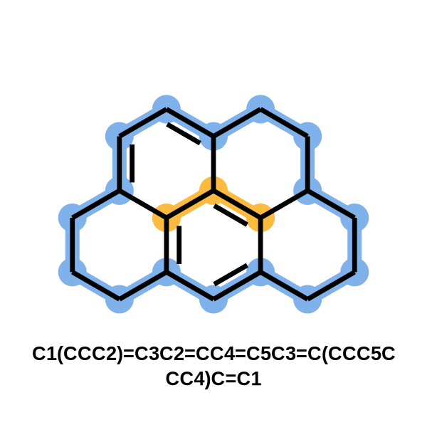

# ChemDraw

---


Draw molecules with [Plotly](https://github.com/plotly/plotly.py).

**Make molecules look the way you want it!**

The package provides global control of aesthetics with `config`, and allows for local control by specifying details 
for every atom, bond, and ring.


(Development still in progress. So there are some bugs. But its working pretty well so far!)

---

## Installation

Pip installable package available.

`pip install chemdraw`

[pypi: chemdraw](https://pypi.org/project/chemdraw/)

---
---

## Dependencies

* [numpy](https://github.com/numpy/numpy) (1.23.1)
  * Used for math
* [plotly](https://github.com/plotly/plotly.py) (5.9.0)
  * Plots molecules
* [kaleido](https://github.com/plotly/Kaleido)  (0.1.0post1)
  * Converts plotly graphs to images (png, svg, etc.)
  * I am not using the most recent version of kaleido as it does not play nice with my computer. Try the newest 
    version, but if you are having issues install this specific version. 
* [rdkit](https://github.com/rdkit/rdkit) (2022.3.4)
  * Convert SMILES to position coordinates.
* [Pillow](https://github.com/python-pillow/Pillow) (9.2.0)
  * Used for image manipulation.
* [scikit-learn](https://github.com/scikit-learn/scikit-learn) (1.1.1)
  * Used to reorient molecules.

---
---

# Examples:
(Image may be distorted from viewer, but real image is not.)


## Basic Usage
```python
import chemdraw

mol = "O=C(C)Oc1ccccc1C(=O)O"
drawer = chemdraw.Drawer(mol, title=mol)
fig = drawer.draw()
fig.show()
```


---
## Grid


```python
import chemdraw

molecules = [
    "CCCCCCCCCC",
    "CC(CC(CCC)C)CC",
    "CCC1CC1",
    "O1CCCCC1C",
    "C1=CC=CC=C1C",
    "O=C(C)Oc1ccccc1C(=O)O",
    "C1(CCC2)=C3C2=CC4=C5C3=C(CCC5CCC4)C=C1",
    "CC(C)(C)N(C)C(=O)C14C3C2C1C5C2C3C45C(=O)C69C8C7C6C%10C7C8C9%10",
    "CC3C(C(=O)OCC1=CCN2C1C(CC2)OC(=O)C(CC(=O)O3)(C(C)C)O)(C(C)C)O",
    "N#CCC1(CC(O1)C2=CC(=NC2=O)OC)O"
]

drawer = chemdraw.GridDrawer(molecules)
drawer.draw_png("example_2")
```


---

## Atom, Bond, and Ring Numbers

Atom Numbers (black text) 

Bond Numbers (gray text)

Ring Numbers (maroon text)

```python
import chemdraw

mol = "C1(CCC2)=C3C2=CC4=C5C3=C(CCC5CCC4)C=C1"

config = chemdraw.DrawerConfig()
config.atom_numbers.show = True
config.bond_numbers.show = True
config.ring_numbers.show = True

drawer = chemdraw.Drawer(mol, title=mol, config=config)
fig = drawer.draw()
fig.show()

```


---

## Ring Highlights

```python
import chemdraw

mol = "C1(CCC2)=C3C2=CC4=C5C3=C(CCC5CCC4)C=C1"

config = chemdraw.DrawerConfig()
config.ring_highlights.show = True

molecule = chemdraw.Molecule(mol)
for ring in molecule.rings:
  ring.highlight = True  # all rings are highlighted (with default highlight_color)
  if ring.aromatic:  # highlighted aromatic green
    ring.highlight_color = "rgba(0,255,0,0.5)"

drawer = chemdraw.Drawer(molecule, title=mol, config=config)
fig = drawer.draw()
fig.show()

```


---
## Atom and Bond Highlights

```python
import chemdraw

mol = "C1(CCC2)=C3C2=CC4=C5C3=C(CCC5CCC4)C=C1"

config = chemdraw.DrawerConfig()
config.highlights.show = True

molecule = chemdraw.Molecule(mol)

# highlight outer ring bonds and atoms
bond_ids = [0, 1,  2, 19, 5, 6, 21, 15, 14, 13, 12, 11, 10, 16, 17, 18]
for id_ in bond_ids:
    molecule.bonds[id_].highlight = True
for atom in molecule.atoms:
    atom.highlight = True

# highlight inner bonds and atoms
accent_color = "rgb(252,186,63)"
molecule.bonds[8].highlight = True
molecule.bonds[8].highlight_color = accent_color
molecule.bonds[20].highlight = True
molecule.bonds[20].highlight_color = accent_color
atoms_ids = [4, 8, 9]
for id_ in atoms_ids:
    molecule.atoms[id_].highlight_color = accent_color

drawer = chemdraw.Drawer(molecule, title=mol, config=config)
fig = drawer.draw()
fig.show()
```




